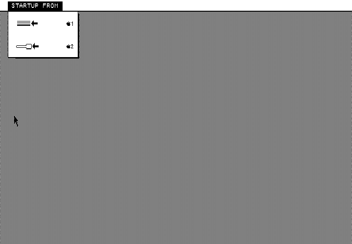
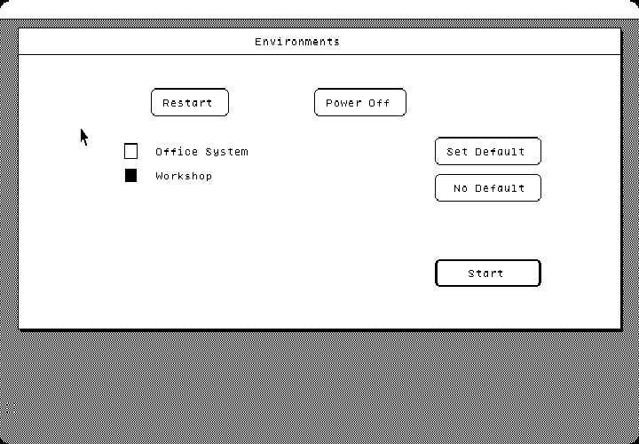
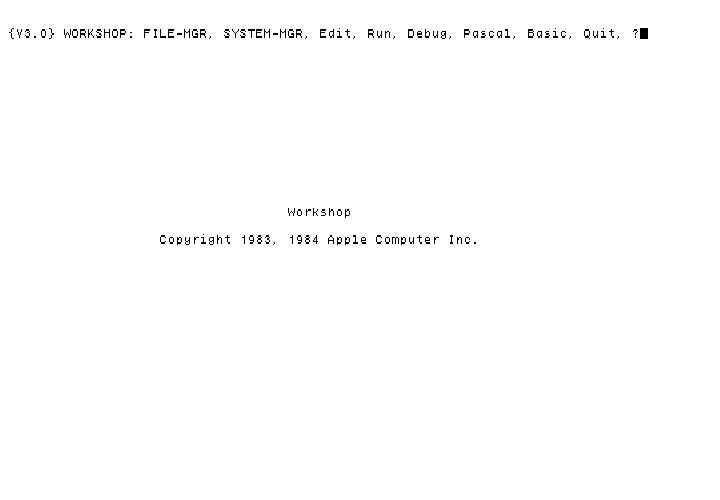
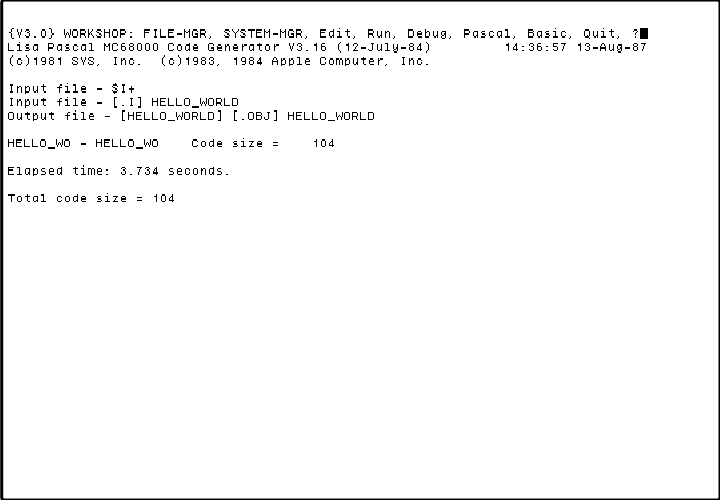
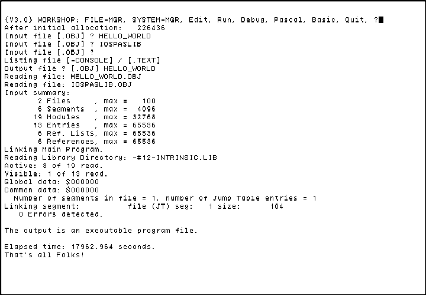

# LisaEm as a Lisa Software Development Environment

**Author:** [TorZidan](https://github.com/TorZidan)  
**Last Updated:** Aug 14, 2026  

---

# Introduction
This tutorial/codelab is geared towards LisaEm beginners.

There has been renewed interest from the Lisa enthusiast community to write new software for this 40-years old platform, for the following reasons:
 - In January of 2023 Apple open sourced the Lisa Office System  (LOS) 3.0 source files (and more), at https://info.computerhistory.org/apple-lisa-code
 - In  June of 2025, young Alex Anderson-McLeod did the impossible: he was able to compile the code, using a real Apple Lisa, see https://github.com/alexthecat123/LisaSourceCompilation . This was, ummm, impressive.
 - AI vibe coding can generate fully-working applications with just a few prompts, and - turns out - AI knows Lisa Pascal quite well!

The LisaEm emulator is the best Lisa software development environment out there. Read-on to see how easy it is to code in Lisa Pascal.

# Overview of the Lisa software development process

- Prerequisites: a decent PC running Linux or MacOS or Windows.

- Write your app in Pascal/Assembler/Basic/Cobol code on your PC, in your favorite text editor. Or, if you are brave and adventurous, you can write your code in LisaEm, in the Lisa Workshop Editor.

- Run the LisaEm emulator on your PC.

- Upload your code to the Workshop environment running in LisaEm (instructions follow).

- Compile and link your code in Workshop on LisaEm. If it's a "UI" app, you restart into LOS, where you run and test your app (LOS can "see" all Workshop files, including your app, as they are on one "volume"). If it's a Workshop app (has on UI), you run and test it in Workshop.

- Once satisfied, optionally, try it on a real Lisa if you can, and don't be shy to share it with others!

- There are some early efforts in LisaEm to orchestrate (control) Lisa's mouse cursor and keystrokes programmatically. Once fully implemented, this will unlock an AI "super cycle", where you can tell an AI to write code, then "explain it" how to copy it (to a disk image), then compile, build, run and test the code in LisaEm, and repeat until the AI achieves the desired outcome.

The detailed steps below are for Linux, but you can adapt them to MacOS and Windows, too.

## Easiest way to run LisaEm on Linux

- Download the latest release's "AppImage" file, from https://github.com/arcanebyte/lisaem/releases into your `~/Downloads` folder.

- Make the file "executable", e.g. : `chmod +x ~/Downloads/LisaEm-9.9.0-2226.08.25-Linux_x86_64.AppImage`

- Launch it: `~/Downloads/LisaEm-9.9.0-2226.08.25-Linux_x86_64.AppImage` . This is it. The LisaEm UI window should show up.  How it works: Linux will automatically "unzip" the AppImage file into a new folder under "/tmp", and launch the `lisaem` binary from there. Once you close LisaEm, your Linux OS will automatically clean up (delete) that temporary folder. The LisaEm preferences file is typically in `~/lisaem.conf`, so it will not get deleted, which is what we want. Now is the time to check out the "Help->About LisaEm" popup dialog.

- Remember where your AppImage file is, for future use :) . Recommendation: Create a subfolder `~/Applications` and move it there. Optionally, figure out how to create a shortcut to it, onto your Linux desktop.

- A newer LisaEm release is available at https://github.com/arcanebyte/lisaem/releases ? No problems: delete the old AppImage file, and follow again the steps above to download and run the new one.

## Setting up LisaEm for a 1st time

- Lisa ROMs: Apple Lisa ROMs are copyrighted firmware. Use ROM image files only if you have the legal right to use them, e.g. if you own a real Apple Lisa. You need the ROM files in order to run LisaEm (there was a "romless" mode which is still broken).
If you don't want to go through the trouble of dumping the ROMs from your Lisa CPU board, you can just follow the instructions at https://www.macintoshrepository.org/articles/626-how-to-install-the-original-boot-rom-for-lisaem (it contains a download link for the Lisa ROM files). 

   TL;DR: "version H" ROMs are recommended, you can find it in files 3410175H.bin and 3410176H.bin at the link above; you will rename these files as instructed above, set them up in the LisaEm's File -> Preferences dialog, apply and reboot LisaEm. It will merge them automatically into one file "boot.ROM", and LisaEm will use that file at subsequent launches.

- Choosing a ProFile hard disk image: Apple chose the pompous name "ProFile" for their bulky external 5MB hard drive. In LisaEm, you need a ProFile hard disk image file. You can start from a blank file and install your favorite Lisa operating system on it, from installation floppy disk images, which is quite satisfying, I promise. However, if you want to develop Lisa Office System applications, Alex Anderson-McLeod has prepared the `LOS_Compilation_Base.image` image file for you at https://github.com/alexthecat123/LisaSourceCompilation/blob/main/LOS%20Compilation%20Base.image.zip ; download it, unzip it, start LisaEm (do not launch the emulation just yet), go to File->Preferences, go to tab "ports", and, under "parallel port" enter the path to that file (e.g. `/home/your-username/ProfileImages/LosCompilationBase.image`). Apply and restart LisaEm. Why is this a good start: this disk image has both Lisa Office System 3.0 and Workshop 3.0 installed; you can choose which one to boot into; also, the file size of ~50MB is about the largest disk size that Lisa Office System supports (do not quote me on this); also, it contains a serial transfer utility written by Alex that we will use to upload our source code on the Lisa, in the Workshop development environment. Note: the image file is in "raw" format: it contains a bunch of sectors; it has no headers or anything else inside that could tell software (such as LisaEm) what this file is; the file extension ".image" is also too-generic; LisaEm tries to use it, hoping that it is a valid useful Lisa hard disk image; if you pick the image with the browse button rather than typing its path, you will see an "Unable to identify disk format. It will be used as-is." popup once, at that moment; click OK to discard it. It does not come back on later startups or when you save preferences.

- Other LisaEm preferences: Run again LisaEm, go to File->Preferences, and choose "I/O ROM: 88" from the drop-down menu. Reason: in this specific I/O ROM, the hard drive is the "top most" in the Lisa boot menu; this is needed, because the `LOS_Compilation_Base.image` disk image (above) was created with this setting; if you choose a different I/O rom, you may get a System Error 10738 during boot time. Apply to save, then OK to close the dialog.

- If you choose to transfer files to the Lisa over the Serial port B: you'll need to setup a Pseudo TTY port in LisaEm, which will emulate serial port transfer of data and files to/from the Lisa. To do so: Launch again LisaEm, go to File->Preferences, go to the "ports" tab, and, under "Serial B" choose "PseudoTTY" from the drop-down menu, make sure the "xon/xoff" check box is NOT checked, and type "/tmp/b" in the text field below it. Apply to save. Upon next launch, LisaEm will open a pair of master/slave Pseudo-TTY ports. LisaEm will listen on the master port; you will use the slave port to communicate with the Lisa. The slave ports are named e.g. `/dev/pts/9`; it may change every time you reboot your Linux PC . To save you the trouble of finding the exact port name, LisaEm creates a symlink named "/tmp/b" to this port (or however you chose to name it above); Now you can use port name "/tmp/b" to communicate with the Lisa, as if you were connecting to it over a serial connection, but, in fact, no cables and no serial ports are needed or used; it's all software-based "glue".

- Leave all other LisaEm preferences as-is.

- We are finally ready to run this for real (is software emulation real? you judge): start LisaEm and choose the "Key-> Power Button" menu to start the emulation. The Lisa screen will lit up, it will do a brief self-test, and you will be presented with the Lisa boot menu. Your mouse should work on the Lisa screen, try it:

   

- Above, click on the hard drive icon (or on apple-logo 1), to boot from it. You should be presented with the "Lisa Office System Environments Selector" menu:

   

 - Here you can choose to boot into Lisa Office System or into the Workshop development environment. We want the latter: choose the check box next to "Workshop" and click the "Start" button. You will be presented with the workshop main menu (a bunch of command across the top of the screen):

   

- Now is the time to speed things up. Go to the "Throttle" menu and choose "512MHz". What it does: the real lisa runs at 5MHz, which means 5 million Motorola 68000 CPU instructions per second; it's sllllllow. Once you choose "512MHz", the emulator will TRY to run 512 million CPU instructions per second (about 100 times faster than the original Lisa!). 512MHz is completely sustainable, possible and stable on a modern PC (with multi-core CPU), and leaves your PC, including the LisaEm menus, fully responsive and usable; if your PC is an oldie, it will try to run at this desired max speed, but it may not be able to reach it. Check the lower-left status bar for the actual speed that it is able to achieve.

- Lisa Workshop has an annoying feature: it "dims" the screen after a period of user inactivity (no mouse moves and no keyboard clicks). Then, when you move the mouse, the screen "lits up" again. This is extremely annoying at high throttle speeds, since the screen dims almost instantly once you stop moving the mouse. There is a workaround: click on the "Display -> Disable Screen Dimming" menu option.

- To shut down the Lisa emulation: click on the "power on/off" button in the lower right corner of the emulator, or, in Workshop, choose Q (Quit), then "Y" (yes)", then "P" (power off). The Lisa screen will turn black. Close the LisaEm application.

## Testing the Pseudo TTY connection

Before getting into file transfers over serial port, it is useful to know how to test if the Pseudo TTY connection works. It's easy:

- Boot LisaEm into Workshop and hit "T" (TransferProgram); it will launch a "Transfer" UI window, with its own menus. Use the menus to choose the following connection settings: `connector=PortB, baudrate=<any value you desire>, parity=None, handshake=None, duplex=Full`. 

- On the host Linux PC, install  the command-line utility `picocom` e.g. `sudo apt install picocom` and launch it: `picocom /tmp/b`; it should successfully connect to this port (`/tmp/b`, which is a symlink for the actual pseudo tty slave port, e.g. `/dev/pts/9 `).

- Now type something in the Lisa Transfer window; it should appear in picocom on the other side. Now type something in picocom; it should appear on the other side, in Lisa Transfer. Cool. Note: Lisa uses the "Carriage Return" (aka "\r", symbol 0x0D) for new lines, so when you type "Enter" in the Lisa Transfer app, on the Linux side you will not see a new line, as that is not a valid new-line in Linux (is not a "Line Feed" "\n"). We are done. Close picocom by hitting Ctrl+a+x all at the same time (if you have that many fingers); Close the Lisa Transfer from its Control->Exit menu. You are back in the Workshop main menu.

## Transferring text files to the Lisa Workshop environment

Copy/paste/save the sample "hello world" Pascal program below into a file `/tmp/HELLO_WORLD.TEXT` on your PC (this file path is just a suggestion). 

   ```
   PROGRAM HELLO_WORLD;

   BEGIN
      writeln(' Hello, World! That''s all Folks!');
   END.
   ```

Obviously, you can use Workshop's Editor to create/ edit and type-in directly your file in LisaEm. However, for large files that is not practical,
given the small screen and the fact that the Editor does not show any line numbers.

So next, we will transfer it into LisaEm. How? You've got choices now!

   1. Copy/paste over generations of compute!

      On your PC, copy the text into your clipboard; on the Lisa, open the desired text file in the Workshop editor. Position the cursor where you want to paste the text. Choose Edit->Paste in the LisaEm menu. LisaEm will slowly "paste" (more like type-in) the text found in your Linux clipboard. Save, close the editor, done. Obviously, works only for small amounts of text.

   1. Recommended: copy the file onto the ProFile disk image using the python tool at https://github.com/TorZidan/LisaFileSystemTool/blob/main/LisaFileSystemToolPerFile.py, e.g.

      ```
      python3 LisaFileSystemToolPerFile.py put LOS_Compilation_Base.image /tmp/HELLO_WORLD.TEXT 
      ```

      This is by far the easiest way. It is consistently reliable and has no pitfalls. Requires Python 3 on your PC.
      It properly converts the "modern" new-line symbols in the text file (\n on Linux, \r\n on Windows) to Lisa's \r .
      Make sure that LisaEm is not running when doing the above, to avoid having two applications modifying the disk image file at the same file.

   1. Use a modern serial file transfer tool such as LISACom at https://github.com/GyroPilot/Apple-LISACom.

      This approach uses the Pseudo TTY connection we setup and tested above. Boot LisaEm into Lisa Office system, mount the floppy disk DC42 image (found on the project webpage) that contains the LISACom app, launch the app from there and follow the instructions. You need to have both Lisa Office System (LOS) and Workshop installed on the same disk image: you will boot into LOS and use LISACom to transfer the file, then reboot into Workshop to compile it. LOS "hides" all text files from you, including the one you just transferred. Will LISACom convert the "modern" new-line symbols (\n on Linux, \r\n on Windows) to Lisa's \r ? We don't know, figure it out.

   1. Transfer files overt the Serial Port using Pseudo TTY connection using Anderson-McLeod's approach when he compiled the Lisa OS source files:

      - We will use Anderson-McLeod's utilities described at https://github.com/alexthecat123/LisaSourceCompilation, once we make some small necessary modifications. This approach allows us to upload text files or folders-with-files from the Linux host to the Lisa Workshop environment. Downloading  of files from the Lisa is not supported; upload of binary files to the Lisa is not supported, it works only for text files.

      - One-time setup to turn off "handshake", because LisaEm does not support it: 
         - On the Lisa side, the upload uses a "macro" text file in Lisa Workshop named ALEX/TRANSFER.TEXT. We need to modify it to turn off "handshake". It's better to make a copy first: run LisaEm and boot into Workshop. Choose "F" (file manager), then "C" (copy), then follow the prompts to copy file ALEX/TRANSFER.TEXT into file ALEX/TRANSFER_NO_HANDSHAKE.TEXT (or choose a simpler name if you fancy it). Then "Q" (quit) the file manager, "E" (edit) to launch the editor, where it will ask you which file you want to edit. Enter ALEX/TRANSFER_NO_HANDSHAKE.TEXT, it will open it for edit. The file looks like this: https://github.com/alexthecat123/LisaSourceCompilation/blob/main/src/ALEX-TRANSFER.TEXT . You will need to change part of the text on Line 3 from `1{DTR Output Handshake}` to `0{No Output Handshake}`, and then part of the text on Line 4 from `1{DTR Input Handshake}` to `0{No Input Handshake}`, and then figure out how to save it and exit the editor. Why is this needed: the Pseudo TTY communication does not support DTR (Data Terminal Ready) handshake, so we are turning it off. 

      - On your Linux PC, we'll use Alex's `lisa_serial_transfer.py` program, you can find it at https://github.com/alexthecat123/LisaSourceCompilation/blob/main/scripts/lisa_serial_transfer.py, and download it to e.g. folder `/tmp` (this file path is just a suggestion). Make sure you have Python 3.x installed. Also, install the "pyserial" library: `pip3 install pyserial`.

      - Launch the file transfer utility on the Lisa: in the main Workshop menu, type "R" (run) and type `<ALEX/TRANSFER_NO_HANDSHAKE` (note the "<" in front, it tells to Workshop "run this file as a macro", more on macro-s later on). Enter to launch it. The screen will turn blank. What happened: Lisa moved the main console (similar to stdin/stdout in Linux) to Serial Port B. Now you have full control over that serial port (you can see try that with `picocom /tmp/b` on the Linux host, but let's move on with file upload).

      - On your Linux PC run: `python3 /tmp/lisa_serial_transfer.py /tmp/b /tmp/HELLO_WORLD.TEXT --no_handshake`. Once prompted, hit Enter to start the transfer. It should take a second, and, upon success, Lisa should come back to the Workshop menu (actually will be in the "SYSTEM-MGR" submenu), with the text "Console moved to Main". Again on the Lisa, hit "q"(quit) to exit back to the main Workshop menu.

   Next, on the Lisa, verify that the file is there: Boot LisaEm into Workshop, then type "F" (file manager), L (list), type `HELLO_WORLD.TEXT`, enter. It should list and show you the file name, size, creation date, etc. Optionally, open the file in the Workshop Editor and observe its contents.

## Compiling, linking and running the sample HELLO_WORLD.TEXT program.

- Now that our source file HELLO_WORLD.TEXT is on the Lisa, let's compile, link and run it.

- Compiling: In the main Workshop menu type "P" (pascal) to launch the Pascal compiler. Input file: `HELLO_WORLD`. List file: none, just enter. Output file: just enter to use the suggested `HELLO_WORLD.OBJ`. Compilation should take seconds, and it will produce file `HELLO_WORLD.OBJ`, like so:

   

- Linking: In the main Workshop menu type "L" (linker) to launch the Linker. Input file: `HELLO_WORLD`. Once prompted again for Input file, enter `IOSPASLIB`. Once prompted again for Input file, just Enter. Listing file: just Enter. Output file `HELLO_WORLD`. This will overwrite file `HELLO_WORLD.OBJ` (produced by the compiler in the previous step), but now it is an executable file! Note: file `IOSPASLIB.OBJ` (entered above) contains the essential Pascal libraries, and is needed to link just every Pascal program. Upon success, the screen will look like so:

   

- Running: In the main Workshop menu type "R" (run) and enter `HELLO_WORLD` (or, if you fancy, `HELLO_WORLD.OBJ`). The program will run and show the expected output! Note: this app can run only in Workshop; it cannot be used in Lisa Office System, because it's not a "UI" app. For a sample UI app, check out Alex's [Minesweeper game for LOS](https://github.com/alexthecat123/los_minesweeper).

- But wait, who would want to go trough the many steps above every time we modify the source code? Workshop Macro-s come to the rescue! Save the text below into a file named `HELLO_WORLD_MACRO.TEXT`, and upload it to the Lisa. Now run it there: from the main Workshop menu: "R" (run), and enter `<HELLO_WORLD_MACRO` (note the "<" in front, it tells to Workshop "run this file as a macro") . It will compile, link and run the program. How the macro works: it "types-in" for you all the text in the macro, except the text in the {curly brackets}, which is meant for keeping your sanity, and to understand what the macro does.

   ```
   $EXEC
   P{ascal}HELLO_WORLD
   
   
   L{ink}HELLO_WORLD
   IOSPASLIB
   
   
   HELLO_WORLD
   
   R{un}HELLO_WORLD
   
   $ENDEXEC
   ```

# FAQ

## There are multiple LisaEm repositories on GitHub, whatsupwitthat?

LisaEm was developed by Ray Arachelian. His work is available in his GitHub projects https://github.com/rayarachelian/lisaem-1.2.x (older versions) and  https://github.com/rayarachelian/lisaem. Unfortunately, Ray passed away in 2023. As a tribute to his work, his repositories were left untouched (as-is), and development work was moved to https://github.com/arcanebyte/lisaem, where you can find the latest code.

## Can I upload and compile the Lisa Office System source code in LisaEm, the way Alex Anderson-McLeod did it at https://github.com/alexthecat123/LisaSourceCompilation on a real Lisa?

Yes, you have 2 options:

   1. Recommended: copy the files to the ProFile hard disk image using the shell script at https://github.com/TorZidan/LisaFileSystemTool/blob/main/LisaSourceCompilation . This is by far the easiest way. It takes just a minute to run, it is consistently reliable and has no pitfalls. Requires Python 3 on your PC. Also requires CygWin if running it on Windows.

   1. Serial file transfer over the Serial Port B. It goes like this:
      - Note: we have found that this approach sometimes hangs (due to a bug in the LisaEm serial transfer routines), or creates files with wrong content on the Lisa. Therefore, we no-longer recommend it.
      - On your Linux PC, download the file `lisa-source.zip` from https://info.computerhistory.org/apple-lisa-code and unzip it. 
      - `cd ... folder-with-unzipped-files...`. There should be one sub-folder, named `Lisa_Source`.
      - Download Alex's https://github.com/alexthecat123/LisaSourceCompilation/blob/main/scripts/patch_files.py utility and run it: `python3 patch_files.py Lisa_Source` . It should print "Successfully applied 248/248 patches".
      - Run `<ALEX/TRANSFER_NO_HANDSHAKE` in Workshop in LisaEm (we created this text "macro" file above); it starts waiting to receive files.
      - On your PC: `cd Lisa_Source`, then run `python3 lisa_serial_transfer.py /tmp/b APPS --no_handshake --throttle_tx_millis 1` (this is the same utility that we used above, to transfer files). It will upload all (hundreds of) files in the "APPS" folder to the Lisa, e.g. it will save Linux file `APPS/APBG/apbg-BG.TEXT.unix.txt` into Lisa file `APBG/BG.TEXT` . It does all the necessary file renaming, and it also replaces all linux/windows new-lines (\r or \r\n) with Lisa new lines (\r). It may take hours to complete the transfer. Upon success, the Lisa screen will return back to the "System manager" Workshop submenu. Hit "Q" to come back to the main menu.
      - Now transfer some of the files in the LISA_OS subfolder: Run again `<ALEX/TRANSFER_NO_HANDSHAKE` in Workshop in LisaEm, and then run `python3 lisa_serial_transfer.py /tmp/b LISA_OS --no_handshake --throttle_tx_millis 1` on your PC . Note: Some of the files in the `LISA_OS` subfolder are not needed; the utility knows which files to transfer and which ones to skip.
      - To be honest, it takes a few attempts to do a successful upload; see the next question for more info on that. The good thing is, you need to do it only once.
      - Compile and link everything: run `<ALEX/MAKE/ALL_NODISKS` on the Lisa and give it some personal space. It should take just 15 minutes on a modern PC running LisaEm at 512MHZ. Upon success, you will arrive back to the Workshop main menu.
      - Check https://github.com/alexthecat123/LisaSourceCompilation for how to test/run the compiled code.

## How stable is LisaEm, is it worth my time?

LisaEm runs great on Linux (e.g. on Ubuntu Linux 24, per the author's experience) and probably as-good on other platforms (MacOS and Windows). The Lisa environments Lisa Office System, Workshop and MacWorks XL 3.0 have been tested extensively; other operating systems (Xenix, anyone?) have not been tested much. LisaEm runs consistently well at all "throttle" speeds, including at the top throttle speed of 512MHz (from the "Throttle" LisaEm menu); we recommend running it always at that speed, because there is no good reason not-to. Note that the high emulation speed introduces some quirks: the cursor blinks way too fast in the text Editor. Mouse double-clicks do not work if you move the mouse even slightly between the two clicks; use a steady hand, or use the `File -> Open ...`, `File -> Set aside ...` menu to open/close the currently selected icon/window.

For full disclosure, as of mid-2026, we are aware of a bug where the Lisa Workshop, after many hours of use, become unresponsive to keystrokes, so it appears to  "hang". This needs more investigation. For now, just close LisaEm and re-run it.

## Did you use, or are you using AI to develop LisaEm?

Software developers are turning into AI Assistants, and are bitter about it, understandably; so using AI is a sensitive topic. We try to clearly state, in each github "pull request", if AI was used, and for what. As of mid-2026, I, the author of this article, use AI as a "helper", not as a "coder": e.g.: I have used AI to hunt and fix an elusive memory leak (turns out it was in `mmu.c`), to get help with some basic stuff, like "why compilation fails on MacOS only", or "explain this piece of code". For sure, Ray Arachelian (the original LisaEm author) did not use AI, because it wasn't invented yet.

## Where can I find Lisa softwares online?

http://www.bitsavers.org/bits/Apple/Lisa/

https://www.macintoshrepository.org/software_search.php?s=lisa&sid=&k=

https://www.compu85.net/stuff/Lisa/Software/

https://lisalist2.com/index.php/board,3.0.html (you may need an account, it's free to register).


## I am stuck, what do I do?

File an issue at https://github.com/arcanebyte/lisaem/issues and wait for a reply (may take awhile), or ask the kind people at https://lisalist2.com, they are quite knowledgeable!

# That's all Folks!
